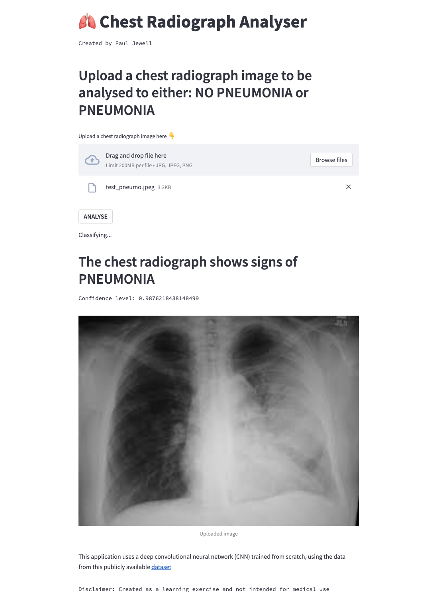

# Chest radiograph classifier

A simple chest radiograph classifier to classify an image of a chest radiograph, as either having signs of pneumonia or not. 
Built by myself as a learning exercise. 
The application uses a deep convolutional neural network, trained on this publicly available [dataset](https://www.kaggle.com/datasets/paultimothymooney/chest-xray-pneumonia)

[Try it here!](https://pdjewell-cxr-classifier-app-v2-21tcbk.streamlit.app/)

Here is a screenshot from the app: 

